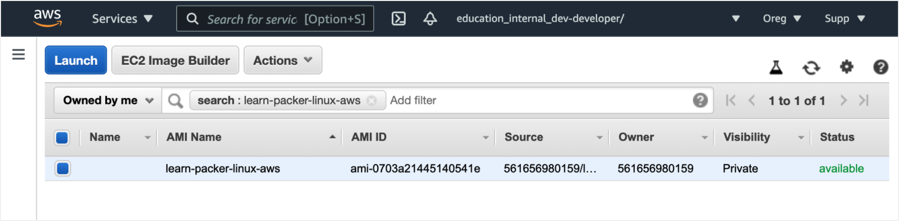
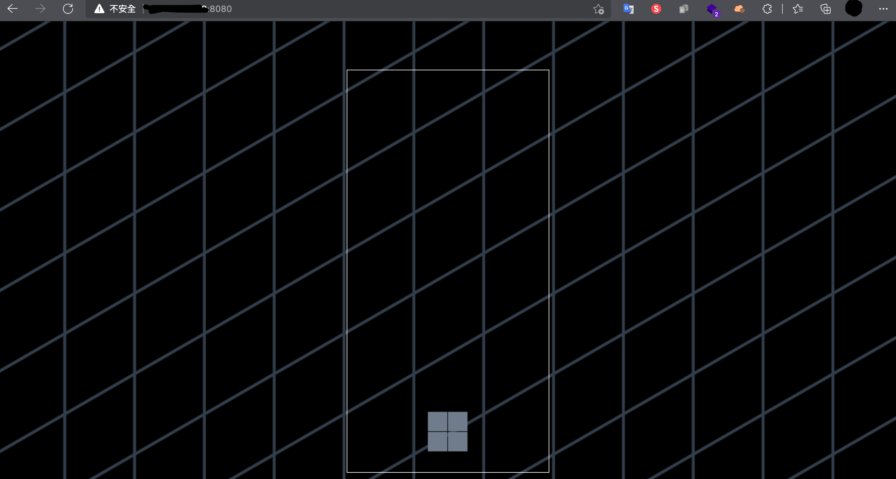
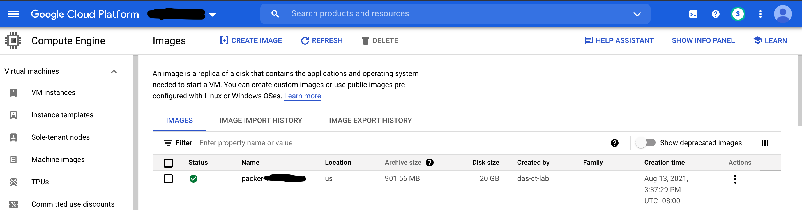
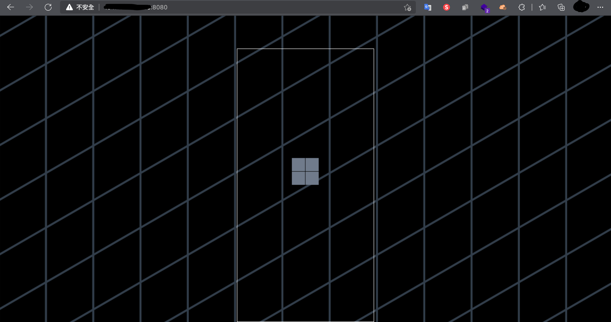

## 

### Download for `MacOS`
```bash
wget https://releases.hashicorp.com/terraform/1.0.4/terraform_1.0.4_darwin_amd64.zip
wget https://releases.hashicorp.com/packer/1.7.4/packer_1.7.4_darwin_amd64.zip

unzip terraform_1.0.4_darwin_amd64.zip && mv terraform /usr/local/bin/
unzip packer_1.7.4_darwin_amd64.zip && mv packer /usr/local/bin/
```

## Clone Project
```bash
git clone https://github.com/neilkuan/packer-warkflow.git
```

## Packer Demo AWS
```bash
cd learn-terraform-provisioning-aws
```

Generate a new SSH key called tf-packer. The argument provided with the -f flag creates the key in the current directory and creates two files called tf-packer and tf-packer.pub. Change the placeholder email address to your email address.
```bash
ssh-keygen -t rsa -C "terraform@example.com" -f ./tf-packer
```

```bash
cd images
packer build image.pkr.hcl
--- output ---
amazon-ebs.example: output will be in this color.

==> amazon-ebs.example: Prevalidating any provided VPC information
==> amazon-ebs.example: Prevalidating AMI Name: learn-terraform-packer
    amazon-ebs.example: Found Image ID: ami-07f5c641c23596eb9
==> amazon-ebs.example: Creating temporary keypair: packer_601c660b-e33f-7875-ab03-ae9a42345198
==> amazon-ebs.example: Creating temporary security group for this instance: packer_601c660f-5a26-53d2-0321-7094c5044848
==> amazon-ebs.example: Authorizing access to port 22 from [0.0.0.0/0] in the temporary security groups...
==> amazon-ebs.example: Launching a source AWS instance...
## ...
==> amazon-ebs.example: Stopping the source instance...
    amazon-ebs.example: Stopping instance
==> amazon-ebs.example: Waiting for the instance to stop...
==> amazon-ebs.example: Creating AMI learn-terraform-packer from instance i-0054c6c995aacf330
    amazon-ebs.example: AMI: ami-xxxxxxxxxxxx
==> amazon-ebs.example: Waiting for AMI to become ready...
==> amazon-ebs.example: Terminating the source AWS instance...
==> amazon-ebs.example: Cleaning up any extra volumes...
==> amazon-ebs.example: No volumes to clean up, skipping
==> amazon-ebs.example: Deleting temporary security group...
==> amazon-ebs.example: Deleting temporary keypair...
Build 'amazon-ebs.example' finished after 5 minutes 42 seconds.

==> Wait completed after 6 minutes 31 seconds

==> Builds finished. The artifacts of successful builds are:
--> amazon-ebs.example: AMIs were created:
us-east-1: ami-xxxxxxxxxxxx  <-- copy that ami id to learn-terraform-provisioning-aws/instances/main.tf `aws_instance.web.ami part` 
```
Also can see ami on AWS AMI console.


Terraform Part, Let's use the ami( ami-xxxxxxxxxxxx ) created by packer to create instance.
Copy that ami id.

Terraform Apply
```bash
# install aws provider.
terraform init 

# pre-review terrafom will be apply.
terraform plan -var 'image_id=<replace_ami_id>'

# apply terrafom.
terraform apply -var 'image_id=<replace_ami_id>'
aws_security_group.sg_22_80: Creating...
aws_security_group.sg_22_80: Creation complete after 9s [id=sg-xxxxxxxxxxx]
aws_instance.web: Creating...
aws_instance.web: Still creating... [10s elapsed]
aws_instance.web: Still creating... [20s elapsed]
aws_instance.web: Still creating... [30s elapsed]
aws_instance.web: Still creating... [40s elapsed]
aws_instance.web: Still creating... [50s elapsed]
aws_instance.web: Still creating... [1m0s elapsed]
aws_instance.web: Still creating... [1m10s elapsed]
aws_instance.web: Creation complete after 1m14s [id=i-xxxxxxxxx]

Apply complete! Resources: 2 added, 0 changed, 0 destroyed.

Outputs:

public_ip = "http://x.x.x.x:8080" <- open this url on yourbrowser.
```

```bash
# Destory your instance.
terraform destroy -var 'image_id=<replace_ami_id>'
```

## Packer Demo GCP
### Setting GCP Authenticated Credentials
```bash
# login your gcp account.
gcloud auth application-default login

# The application-default credentials will been stored in ~/.config/gcloud/application_default_credentials.json

export GOOGLE_APPLICATION_CREDENTIALS=$HOME/.config/gcloud/application_default_credentials.json
```

### Setting GCP Project
```bash
gcloud set project <project_name>
```

```bash
cd learn-terraform-provisioning-gcp
```

Generate a new SSH key called tf-packer. The argument provided with the -f flag creates the key in the current directory and creates two files called tf-packer and tf-packer.pub. Change the placeholder email address to your email address.
```bash
ssh-keygen -t rsa -C "terraform@example.com" -f ./tf-packer
```

```bash
cd images

packer build -var 'project_id=<replace_your_gcp_project_id>' image.pkr.hcl 

--- output ---
googlecompute.basic-example: output will be in this color.

==> googlecompute.basic-example: Checking image does not exist...
==> googlecompute.basic-example: Creating temporary RSA SSH key for instance...
==> googlecompute.basic-example: Using image: debian-9-stretch-v20200805
==> googlecompute.basic-example: Creating instance...
    googlecompute.basic-example: Loading zone: us-central1-a
    googlecompute.basic-example: Loading machine type: n1-standard-1
    googlecompute.basic-example: Requesting instance creation...

    googlecompute.basic-example: terraform
    googlecompute.basic-example: /home/terraform
==> googlecompute.basic-example: Deleting instance...
    googlecompute.basic-example: Instance has been deleted!
==> googlecompute.basic-example: Creating image...
==> googlecompute.basic-example: Deleting disk...
    googlecompute.basic-example: Disk has been deleted!
Build 'googlecompute.basic-example' finished after 2 minutes 40 seconds.

==> Wait completed after 2 minutes 40 seconds

==> Builds finished. The artifacts of successful builds are:
--> googlecompute.basic-example: A disk image was created: packer-xxxxxxxxx <-- copy that ami id to learn-terraform-provisioning-gcp/instances/main.tf `google_compute_instance.vm_instance.boot_disk.initialize_params.image image part` 
```
Also can see image on GCP Images Console.


Terraform Part, Let's use the image( packer-xxxxxxxxx ) created by packer to create instance.
Copy that ami 

Terraform Apply
```bash
# install aws provider.
terraform init 

# pre-review terrafom will be apply.
terraform plan -var 'project_id=<replace_your_gcp_project_id>' -var 'image_id=<replace_image_id>'

# apply terrafom.
terraform apply -var 'project_id=<replace_your_gcp_project_id>' -var 'image_id=<replace_image_id>'
google_compute_network.vpc_network: Creating...
google_compute_network.vpc_network: Still creating... [10s elapsed]
google_compute_network.vpc_network: Still creating... [20s elapsed]
google_compute_network.vpc_network: Still creating... [30s elapsed]
google_compute_network.vpc_network: Still creating... [40s elapsed]
google_compute_firewall.web: Still creating... [10s elapsed]
google_compute_firewall.web: Creation complete after 16s [id=projects/xxxxxxxxx/global/firewalls/packer-demoweb-firewall]
google_compute_instance.vm_instance: Creating...
google_compute_instance.vm_instance: Still creating... [10s elapsed]
google_compute_instance.vm_instance: Still creating... [20s elapsed]
google_compute_instance.vm_instance: Creation complete after 28s [id=projects/xxxxxxxxx/zones/us-central1-c/instances/terraform-instance]

Apply complete! Resources: 3 added, 0 changed, 0 destroyed.

Outputs:

instance_ip = "http://x.x.x.x:8080"
```



Connect to your instance via SSH.
```bash
ssh terraform@x.x.x.x -i ../tf-packer
The authenticity of host 'x.x.x.x (x.x.x.x)' can't be established.
ECDSA key fingerprint is SHA256:FdoZGjyBpU67LMpYhiVIEJLZ7ws8T5352NQJKcPh+ac.
Are you sure you want to continue connecting (yes/no/[fingerprint])? yes
Warning: Permanently added 'x.x.x.x' (ECDSA) to the list of known hosts.
Linux terraform-instance 4.9.0-16-amd64 #1 SMP Debian 4.9.272-2 (2021-07-19) x86_64

The programs included with the Debian GNU/Linux system are free software;
the exact distribution terms for each program are described in the
individual files in /usr/share/doc/*/copyright.

Debian GNU/Linux comes with ABSOLUTELY NO WARRANTY, to the extent
permitted by applicable law.
terraform@terraform-instance:~$
```

```bash
# Destory your instance.
terraform destroy -var 'project_id=<replace_your_gcp_project_id>' -var 'image_id=<replace_image_id>'
```
